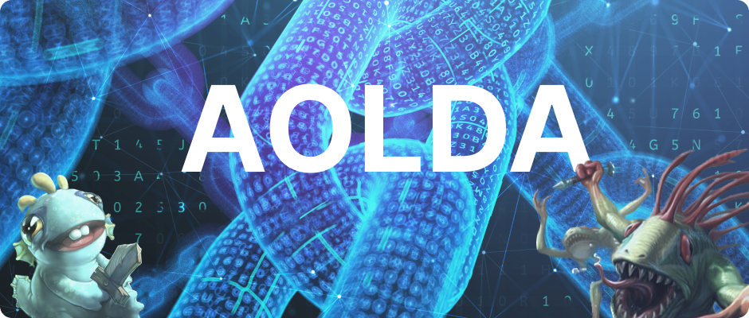

# AOLDA : MULTI VM

<figure><figcaption></figcaption></figure>

### 우리는 EVM과 다른 VM들을 연결합니다.

비트코인이 세상에 처음 나오고 블록체인 기술이 대두되면서 비탈릭 부테린은 solidity와 EVM을 만들어 Smart Contract라는 개념을 블록체인에 도입했습니다.

블록체인은 무궁무진한 가능성을 지니고 있으며, 매우 빠른 속도로 세상을 바꿔나가고 있습니다. 이 빠른 변화 속에서 AOLDA는 **EVM과 다른 VM을 연결하는 새로운 네트워크 시스템**이 블록체인 대중화를 더욱 촉진시킬 KEY ITEM이라고 믿고 있습니다.

## 블록체인이 열어갈 새로운 시장

우리는 solidity외의 언어로 작성된 이 컨트랙트를 FlexiContract라고 부르기로 하였습니다. \
누구나 쉽게 작성할 수 있는 이 플렉시 컨트랙트는 블록체인의 대중화에 크게 기여할 수 있을 것입니다.
