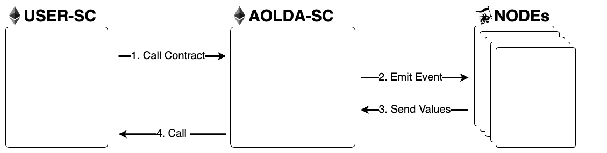

# How to run

## **분산 네트워크 구조**

Solidity 외의 언어를 EVM환경에서 구동하기 위한 솔루션으로 Compiler를 직접 구현할 수도 있지만 이러한 방법은 확장성의 한계를 가질 것이라고 생각했습니다. 기존 Compiler를 사용하여 EVM환경에 Solidity외의 언어를 적용할 수 있다면 높은 확장성을 가지게할 수 있을 것이라고 생각하여 Decentralized Oracle Network를 이용해 이를 구현하기로 하였습니다.

Smart Contract를 이용해 분산 노드끼리의 합의 알고리즘을 구현하여 Solidity 외의 언어로 작성된 함수를 Solidity 내에서 호출할 수 있도록 구현할 것입니다. 아래 그림은 아올다의 네트워크 구성과 WorkFlow를 도식화한 것입니다.

### 아올다의 WorkFlow

1\) USER-SC에서 함수를 호출합니다.\
2\) Oracle Node들은 event log 발생을 감지하고 Compiler를 이용해 해당하는 함수를 호출합니다. \
3\) 함수의 결과값을 AOLDA-SC에 입력합니다.\
4\) AOLDA-SC는 합의 알고리즘에 따라 유효한 입력값을 결정하고 이를 USER-SC에 돌려줍니다.

<figure><figcaption></figcaption></figure>

Nodes를 구성할 단일 Node는 Core, Compiler, Storage로 구성될 것입니다. Core는 External Code를 입력받고 다른 노드와의 합의를 통해 이를 Storage에 저장합니다. 이후 유저가 해당 External Code를 호출하면 이벤트를 감지하고 Compiler를 실행하고 결과값을 SmartContract에 입력하는 방식으로 오라클라이징이 이루어집니다.

Node는 다양한 언어의 Compiler를 가질 수 있으며 이는 높은 확장성으로 연결될 수 있을 것 입니다.
