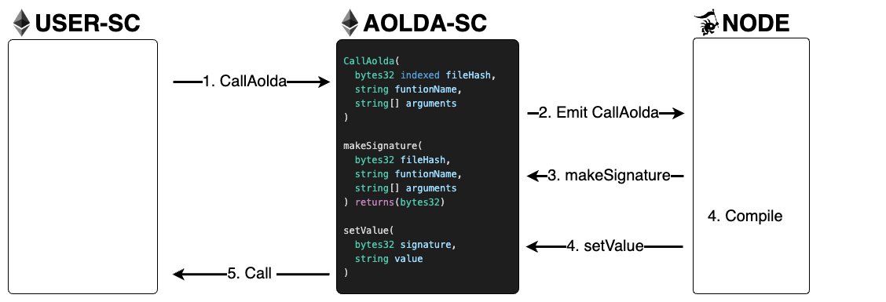

# use

<figure><figcaption></figcaption></figure>

## 작동방식

1. **CallAolda**\
   USER-SC에서 AOLDA-SC의 CallAolda를 Call한다.
2. **Emit CallAolda**\
   CallAolda가 실행되면 CallAolda 이벤트를 emit하고 node는 이를 감지한다.
3. **makeSignature**\
   이벤트를 감지한 node는 AOLDA-SC의 makeSignature를 이용해 입력값에 대한 signature를 생성한다.
4. **Compile**\
   node는 CallAolda에서 입력된 입력값에 대한 스크립트를 찾아 compile하고 결과값을 도출한다.
5. **setValue**\
   node는 결과값을 setValue함수를 통해 입력한다. AOLDA-SC는 Aggregate()를 통해 최종 결과값을 결정한다.
6. **Call**\
   AOLDA-SC가 최종 결과값을 USER-SC를 Call함으로써 전달한다.
