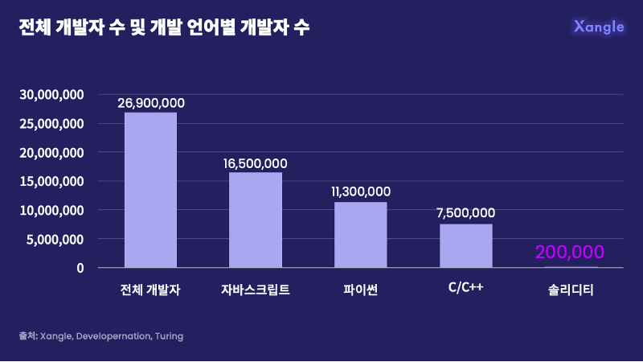

# Motivation

### 아이디어 배경

블록체인이 대중화 되기에는 여러 한계점이 있습니다. 그 중 하나는 블록체인 네트워크를 구현하기 위해서는 solidity라는 대중적이지 못한 언어를 습득해야하는 것입니다. 이러한 문제를 해결하기위해 로우레벨 언어로 컨트랙트를 작성할 수 있는 WASM이 떠오르고 있으며 이 WASM환경을 EVM과 호환되도록 하는 기술도 주목을 받고 있습니다.

<figure><figcaption>
쟁글 : 전체개발자 수 및 개발언어별 개발자 수
</figcaption></figure>

Xangle에서 제공한 자료에 의하면 전체 개발자들 중 JS와 Python 개발자가 압도적으로 많고 solidity에 능숙한 개발자는 극소수입니다. 이러한 문제를 해결하기 위해 대중적인 언어를 이용해 작성한 컨트랙트를 EVM환경에서 호출할 수 있는 솔루션을 고안하고자 했습니다.

ChainLink는 오프체인 데이터와 온체인 데이터의 연결을 목표로 하는 솔루션입니다. 분산 노드들이 외부 API를 호출하고 response를 컨트랙트에 입력함으로써 solidity내부에서 외부 API에 접근할 수 있도록 하는 분산 프로토콜 서비스입니다. 이 과정에서 적절한 response를 주었다고 판단되는 node에게 token을 지급하는 형식으로 네트워크가 유지됩니다.

해당 아이디어에서 착안하여 solidity가 아닌 다른 언어로 작성된 컨트랙트를 solidity 내에서 호출할 수 있도록 할 수 있는 솔루션을 제안할 수 있을 것이라고 생각합니다. Code실행환경과 합의 알고리즘, 보상 체계에 대해 이번 파란학기를 통해 연구하고 구현해보고자 합니다.
