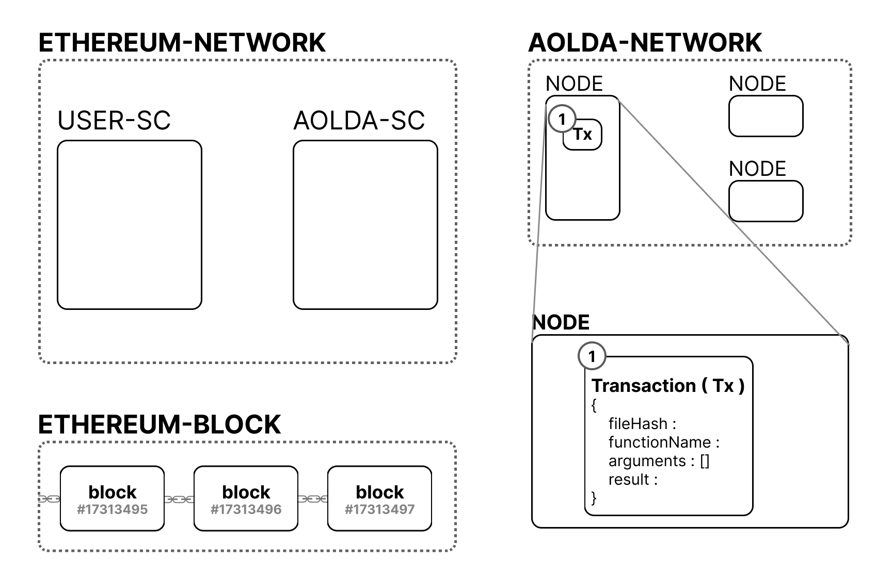

# Confirm Value

## 1. FindTx From Block

<figure><figcaption>
Fig1. FindTx From Block
</figcaption></figure>

(1) 'Call With API'혹은 'Call From EVM'에서 생성된 Transaction body를 이용해 이미 확정된 Block 목록에서 같은 body에 대한 result가 있는 지 확인합니다. 만약 있다면 트랜잭션을 생성하지 않습니다.

## 2. Make Tx

<figure><figcaption>
Fig2. Make Tx
</figcaption></figure>

(1) 없다면 result값을 추가하여 type3의 트랜잭션을 생성합니다.

## 3. Broadcast And Push to Mempool&#x20;

<figure><figcaption>
Fig3. Broadcast And Push to Mempool
</figcaption></figure>

(1) Node는 생성된 트랜잭션들을 모두 다른 Node에게 Broadcast합니다.

(2) 다른 Node들은 트랜잭션의 유효성을 검사하고 이상이 없다면 트랜잭션을 처음 생성한 Node는 트랜잭션을 Mempool에 저장합니다.

## 4. CreateBlock

이전 블럭이 생성된 후 충분한 시간이 지나면 Node는 Mempool에서 트랜잭션을 추출하여 새로운 블럭을 생성합니다. 블럭 생성에 대한 자세한 내용은 [Create Block 페이지](../create-aolda-block.md)에서 확인하세요.
